# Brayan Ospina

**Full Stack Developer · UI & E-commerce**

---

### Sobre mí

Desarrollador web full stack de Colombia. Desarrollo **tiendas e-commerce**, **aplicaciones web** y **sitios con diseño cuidado**, usando React, Next.js y TypeScript.

- Enfocado en productos web con buena experiencia de usuario
- Experiencia en e-commerce, integraciones y storefronts modernos
- **Contacto:** ospinabrayan2005@gmail.com

---

### Tech stack

  
  
  

---

### Proyecto destacado

---

### GitHub Stats

 

 

